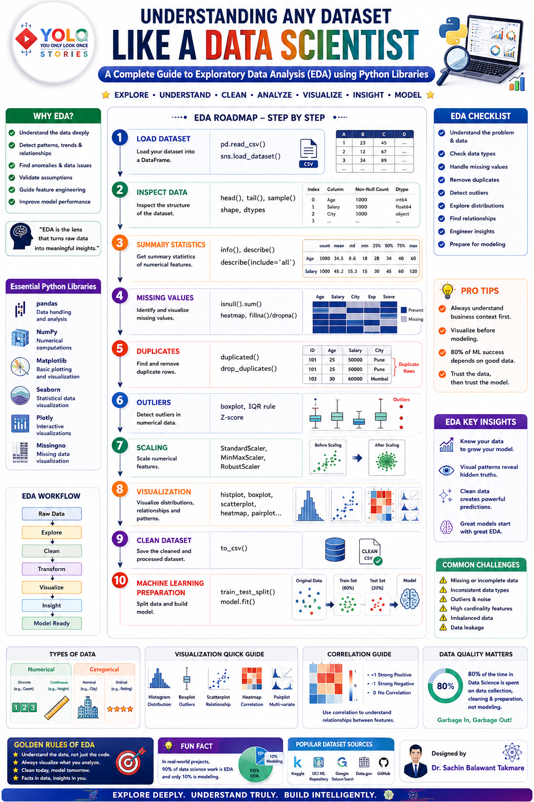

# This README.md File For ALL Experiments of Machine Learning

# Python-Libraries(Exp_No.1)

This Folder contains my learning resources and notes for Python libraries used in Data Science, Machine Learning, and Deep Learning.

These PDFs are for educational purposes and help me revise important concepts.

# Dataset(Exp_No.2)

This folder contains datasets used for Data Science, Machine Learning, and Deep Learning experiments. These datasets support data preprocessing, model training, evaluation, and practical implementation of AI/ML concepts.

