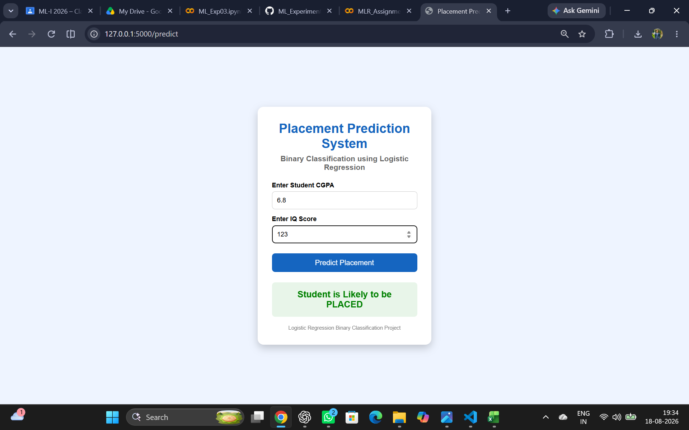
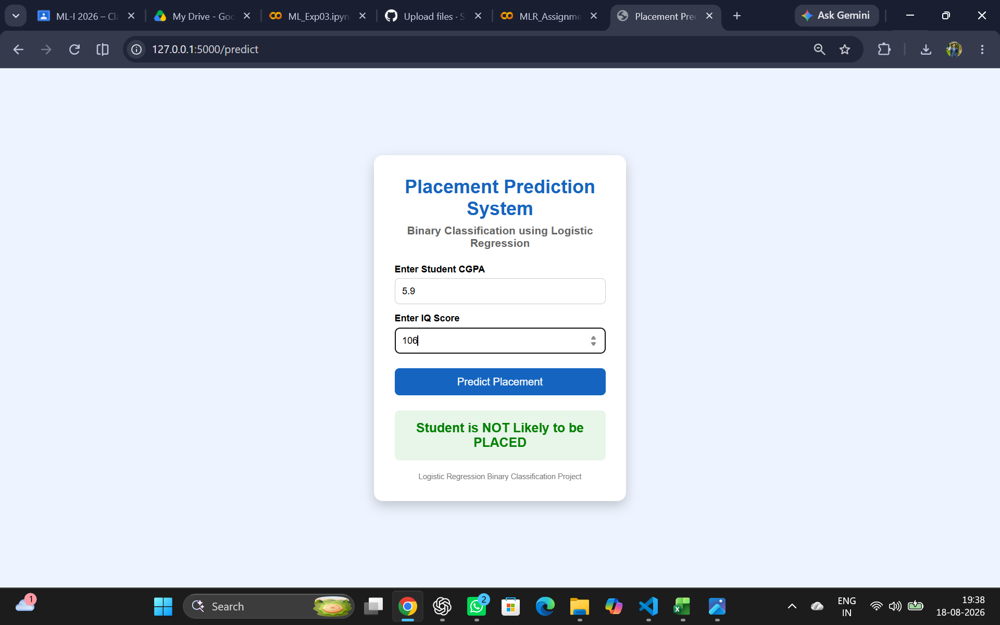
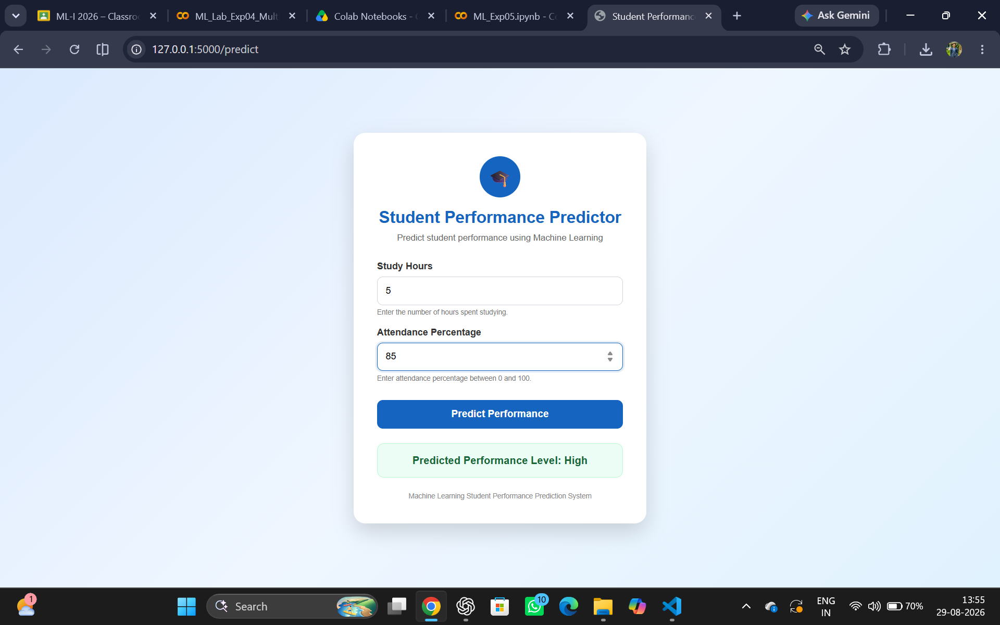
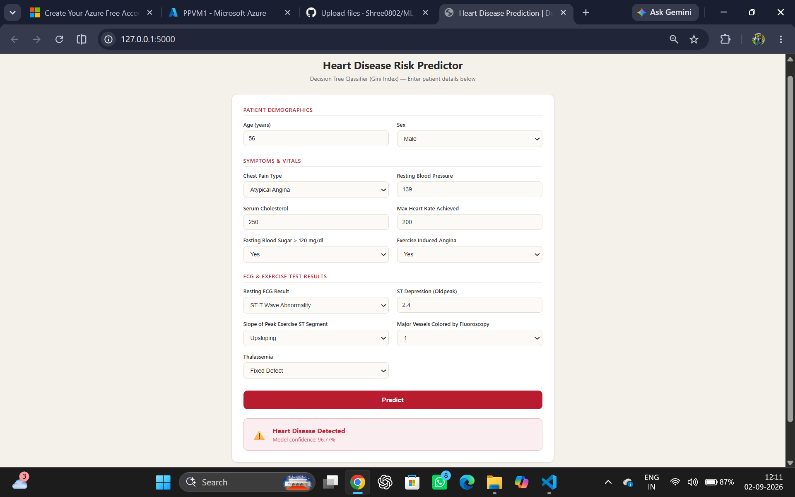
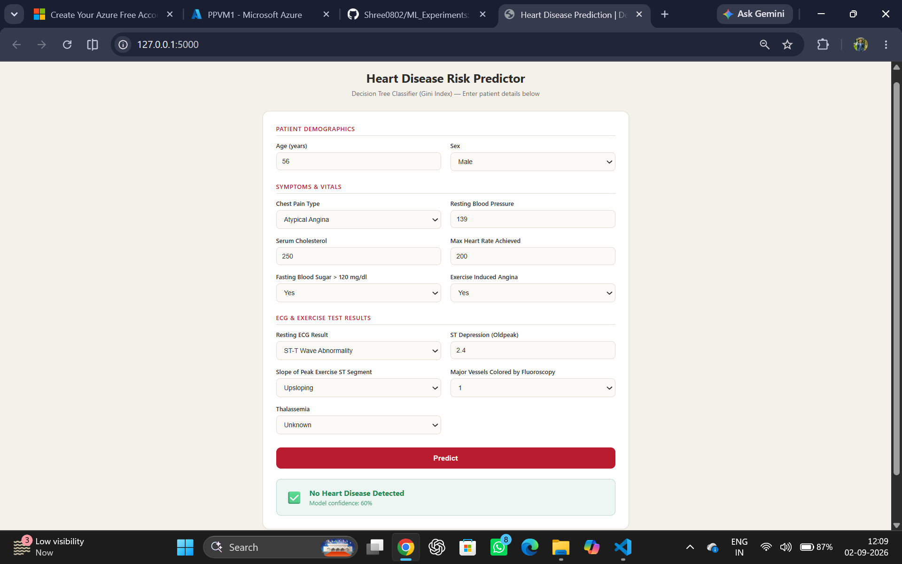

# This README.md File For ALL Experiments of Machine Learning

# Python-Libraries

This Folder contains my learning resources and notes for Python libraries used in Data Science, Machine Learning, and Deep Learning.

These PDFs are for educational purposes and help me revise important concepts.

# Dataset_Model Train(Exp_No.1)

1) This folder contains datasets used for Data Science, Machine Learning, and Deep Learning experiments. These datasets support data preprocessing, model training, evaluation, and practical implementation of AI/ML concepts.

2) Also in this folder included 'Mini Assignment

# Simple Linear Regression(Exp_No.2)

## Objective
Implement Simple Linear Regression to predict values based on a single independent variable.

## Description
This experiment demonstrates the implementation of Simple Linear Regression, including data preprocessing, model training, prediction, and visualization of the regression line.

## Tools Used
- Python
- Pandas
- NumPy
- Matplotlib
- Scikit-learn

## Author
Prathamesh Patil

# Multiple Linear Regression (Exp_No.3)

## Aim
To implement multivariate linear regression using Python and evaluate its performance.

## Description
This experiment demonstrates the implementation of Multiple Linear Regression using multiple input features to predict a target variable. The model is trained and evaluated using performance metrics such as MSE and R² score.

## Tools Used
- Python
- NumPy
- Pandas
- Matplotlib
- Scikit-learn

## Author
Prathamesh Patil

# Logistic_Regression (Exp_No.4)
#Part:1 Binary Clasification

## Aim:
To implement logistic regression for binary classification using Python and
evaluate its performance.

## Description
Implemented a **Logistic Regression** model to predict student placement based on **CGPA and IQ score**. The model performs binary classification to determine whether a student is **Likely to be PLACED** or **NOT Likely to be PLACED**.

The experiment includes data preprocessing, model training using Python and Scikit-learn, prediction, and evaluation using accuracy, confusion matrix, classification report, ROC curve, and AUC.

A **Flask web application** was also developed to provide an interactive interface where users can enter a student's CGPA and IQ score and get the placement prediction in real time.

### Libraries Used

- NumPy
- Pandas
- Matplotlib
- Seaborn
- Scikit-learn
- Pickle
   
# Student Likely To Be Placed According to Dataset Provided

# Student Likely To Be Not Placed According to Dataset Provided

# Logistic_Regression (Exp_No.5)
#Part:2 Multiclass Clasification

## Aim:
To implement multiclass classification using Python and evaluate its
performance.

## Description
Implemented a Multiclass Logistic Regression model to predict a student's Stress Level based on Study Hours, Sleep Hours, and Screen Time. The model performs multiclass classification to determine whether a student has Low Stress, Medium Stress, or High Stress.

The experiment includes data preprocessing, model training using Python and Scikit-learn, prediction, and evaluation using accuracy, confusion matrix, and classification report.

A Flask web application was also developed to provide an interactive interface where users can enter a student's Study Hours, Sleep Hours, and Screen Time and get the Stress Level prediction in real time.

# Student Performance Predictor Using Multiclass Logistic Regression

# Decision_Tree_Clasifier (Exp_No.6)
## Gini Index

## Aim:
To implement a Decision Tree classifier using Python and evaluate its
performance on a given dataset.

## Description
Implemented a Decision Tree Classifier using the Gini Index to predict whether a patient has heart disease or not based on 13 clinical and diagnostic features from the UCI Heart Disease dataset.

The experiment includes data preprocessing, model training using Python and Scikit-learn, prediction, and evaluation using accuracy, confusion matrix, classification report, and ROC-AUC. A Decision Tree visualization and feature importance analysis were also performed.

A Heart Disease Risk Predictor interface was also developed to allow users to enter patient details and obtain a heart disease prediction.

## Heart Disease Risk Predictor
# Heart Disease Detected

# No Heart Disease Detected

