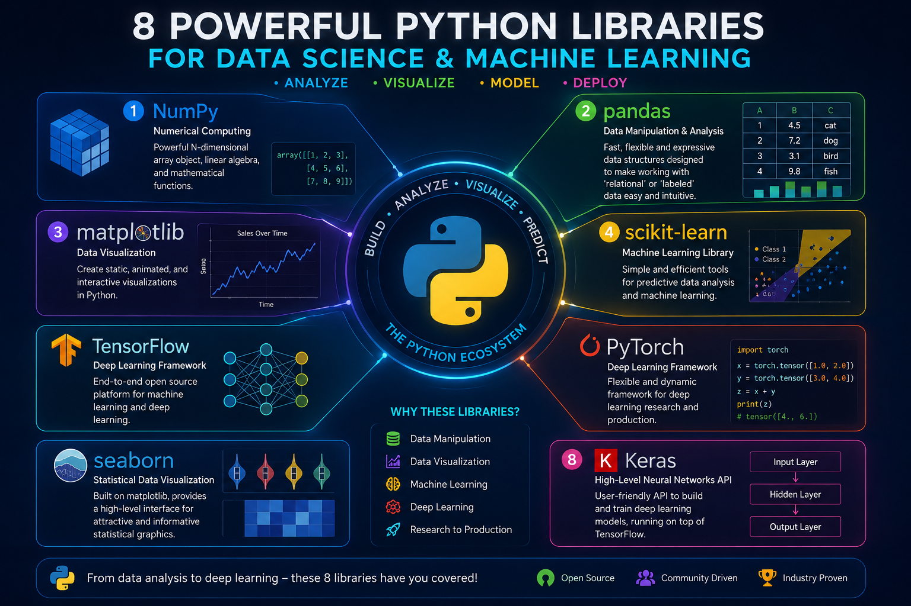
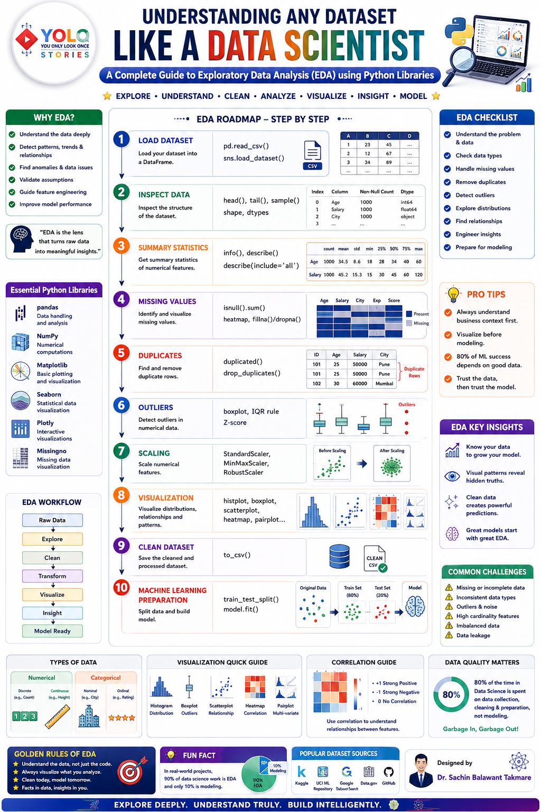
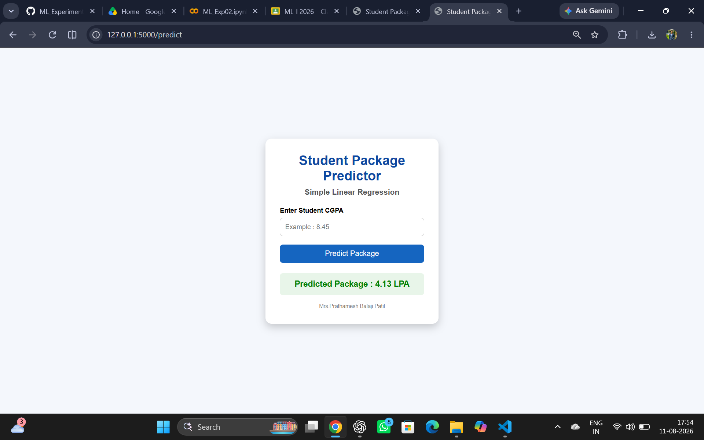
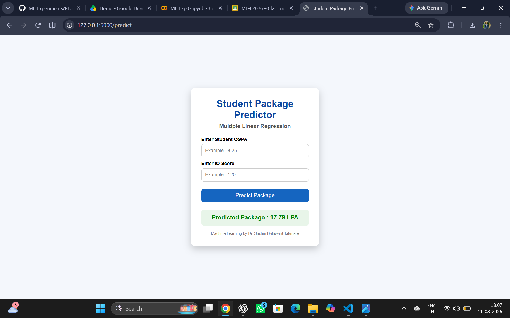

# This README.md File For ALL Experiments of Machine Learning

# Python-Libraries

This Folder contains my learning resources and notes for Python libraries used in Data Science, Machine Learning, and Deep Learning.

These PDFs are for educational purposes and help me revise important concepts.

# Dataset_Model Train(Exp_No.1)

1) This folder contains datasets used for Data Science, Machine Learning, and Deep Learning experiments. These datasets support data preprocessing, model training, evaluation, and practical implementation of AI/ML concepts.

2) Also in this folder included 'Mini Assignment

# Simple Linear Regression(Exp_No.2)

## Objective
Implement Simple Linear Regression to predict values based on a single independent variable.

## Description
This experiment demonstrates the implementation of Simple Linear Regression, including data preprocessing, model training, prediction, and visualization of the regression line.

## Tools Used
- Python
- Pandas
- NumPy
- Matplotlib
- Scikit-learn

## Author
Prathamesh Patil

# Multiple Linear Regression (Exp_No.3)

## Aim
To implement multivariate linear regression using Python and evaluate its performance.

## Description
This experiment demonstrates the implementation of Multiple Linear Regression using multiple input features to predict a target variable. The model is trained and evaluated using performance metrics such as MSE and R² score.

## Tools Used
- Python
- NumPy
- Pandas
- Matplotlib
- Scikit-learn

## Author
Prathamesh Patil

# Logistic_Regression (Exp_No.4)

## Aim:
To implement logistic regression for binary classification using Python and
evaluate its performance.

## Description
Implemented Logistic Regression using Python and Scikit-learn to predict the card assigned to a bank account based on its account type. The experiment includes data preprocessing, categorical encoding, model training, prediction, and evaluation using accuracy, confusion matrix, classification report, ROC curve, and AUC.

### Libraries Used

- NumPy
- Pandas
- Matplotlib
- Seaborn
- Scikit-learn
- Pickle
   
# Student Likely To Be Placed According to Dataset

